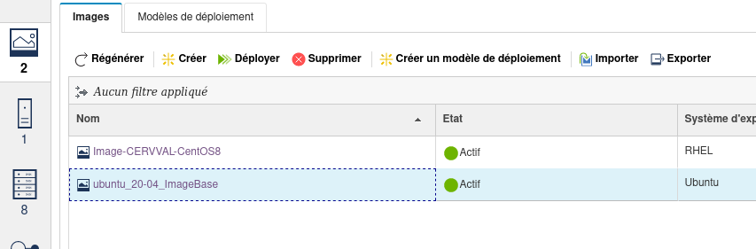

# Machine CERVVAL

[[_TOC_]]

## Introduction

Ce projet contient tout ce qui est nécessaire pour installer une machine de base à partir d'une image **Unbuntu** sur architecture **Power**.

Ce document est accessible via le projet [Gitlab](https://gitlab.infra.asten/snoel/vm-power8) . Il est editable /  consultable avec **Typora**

## Image

L'image choisie est une image `Ubuntu 20.04 LTS`

> **NB**: La machine présente n'a pas été installée en automatique

## Installation 

Dans [PowerVC](https://powervc01.asten.asten/powervc/login.html), le projet 

Déployer l'image Ubuntu

