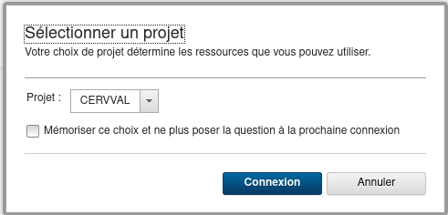

# Machine CERVVAL

[[_TOC_]]

## Introduction

Ce projet contient tout ce qui est nécessaire pour installer une machine de base à partir d'une image **Unbuntu** sur architecture **Power**.

Ce document est accessible via le projet [Gitlab](https://gitlab.infra.asten/snoel/vm-power8) . Il est éditable /  consultable avec **Typora**

## Image

L'image choisie est une image `Ubuntu 20.04 LTS`

> **NB**: La machine actuelle n'a pas été installée en automatique

## Installation 

Dans [PowerVC](https://powervc01.asten.asten/powervc/login.html), choisir le projet 



Déployer l'image Ubuntu


## Configuration

Deux comptes sont créés dans le template : 

- root
- adminasten

> **NB**: Sous Ubuntu le compte root n'est pas accessible en **ssh** par défaut

Vérifier l'adresse IP allouée à la machine

Créer le compte '**administrator**' (compte fournit au client)

Les points de montage du template ne sont plus accessibles lorsque la vm a démarré. Editer /etc/fstab pour prendre en compte les chemins d'accès aux partitions.

```fstab
# /etc/fstab: static file system information.
#
# Use 'blkid' to print the universally unique identifier for a
# device; this may be used with UUID= as a more robust way to name devices
# that works even if disks are added and removed. See fstab(5).
#
# <file system> <mount point>   <type>  <options>       <dump>  <pass>
/dev/mapper/ubuntu--vg-ubuntu--lg / 		ext4 defaults 0 0
/dev/mapper/mpathb-part2 					/boot ext4 defaults 0 0
/swap.img       									none	swap sw     	0 0
/dev/mapper/vg_data-lv_data 			/data xfs  defaults 0 0
```

Relancer la machine, puis mettre à jour Ubuntu :

```bash
apt-get update
apt-get upgrade -y
reboot
```

